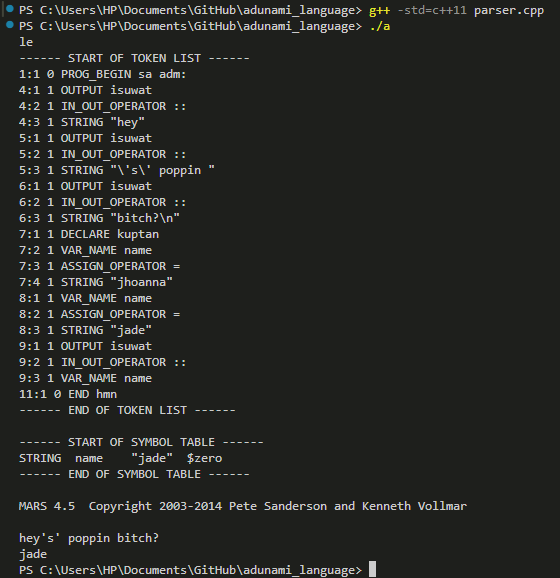

### HOW TO RUN

1. Change directory to where this github repository is found
   ```
    cd [insert path here]
   ```
2. Compile parser.cpp file
   ```
    g++ -std=c++11 parser.cpp
   ```
3. Execute parser.cpp file, the executable file was automatically renamed to a.exe since we did not give it a name in step #2
   ```
   ./a
   ```
4. If it is run successfully, token list and symbol table will be printed. You will also be prompted with the name of .adm file you want to test.
   
   


### Helpful Links
[Adunami Grammae](https://docs.google.com/document/d/1eM8ValkCT9Ux-MlyTgO60H8Zo5uKIbQd9dxzrLSH0JM/edit)

[MIPS SYSCALL CODES](https://courses.missouristate.edu/kenvollmar/mars/help/syscallhelp.html?fbclid=IwAR1BKElZHu8XUUwTMSlEJT83vKo6pVogtgDo6qpgvz4ovWoODgBmyfBr5p4)

[MARS Commands](https://courses.missouristate.edu/kenvollmar/mars/Help/Help_4_1/MarsHelpCommand.html?fbclid=IwAR02EvA5dqFMoh5p2gc3I8G7olrZU298wHmMaKIW8xC0XWfwntUkMFFOBLs#:~:text=MARS%20can%20be%20run%20from,jar%20%5Boptions%5D%20program)

[Write a compiler - Documentation > Write a C Compiler](https://github.com/practical-tutorials/project-based-learning?fbclid=IwAR3UaGj7YsviaxfrG1M1Cyun0cX4laQxM9hw90T7SoOde6DrEQZewNJbFFM)
